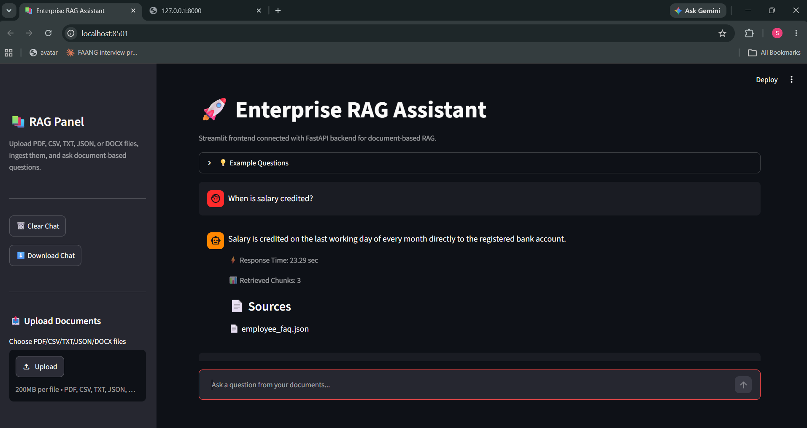
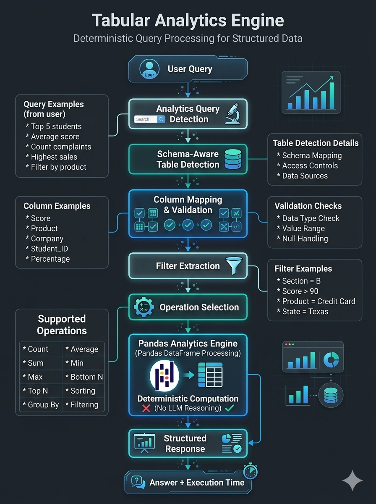
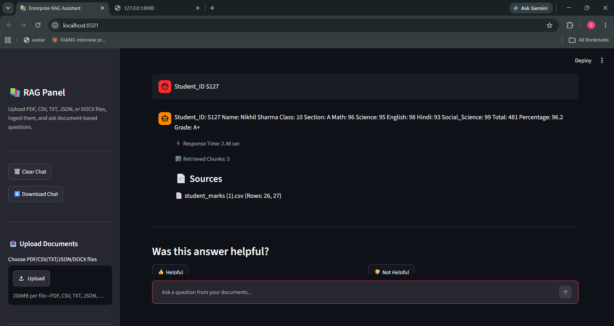
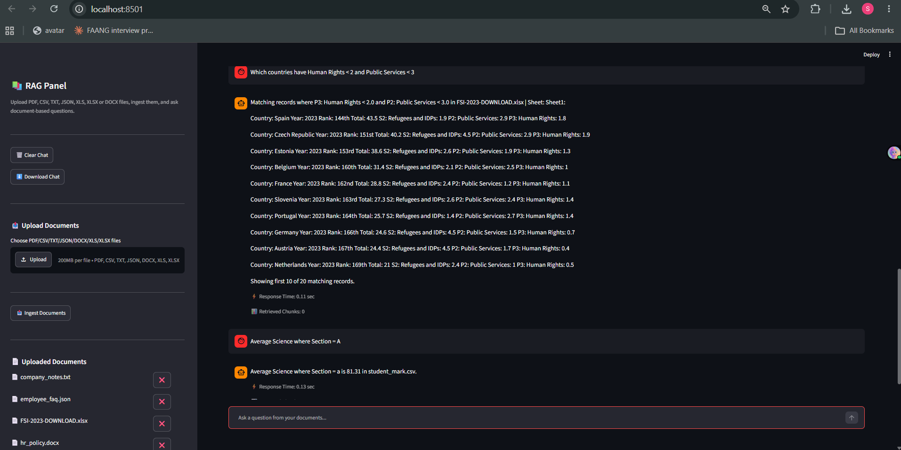
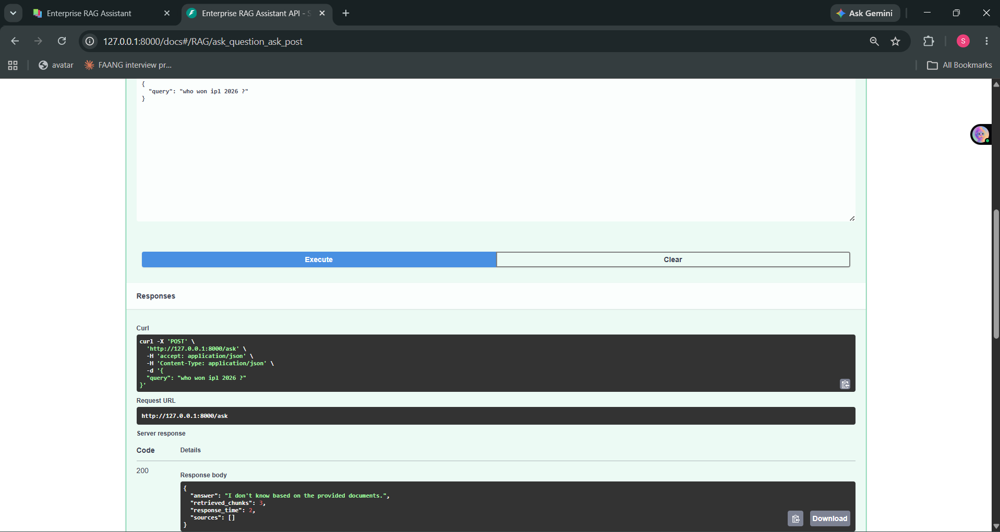
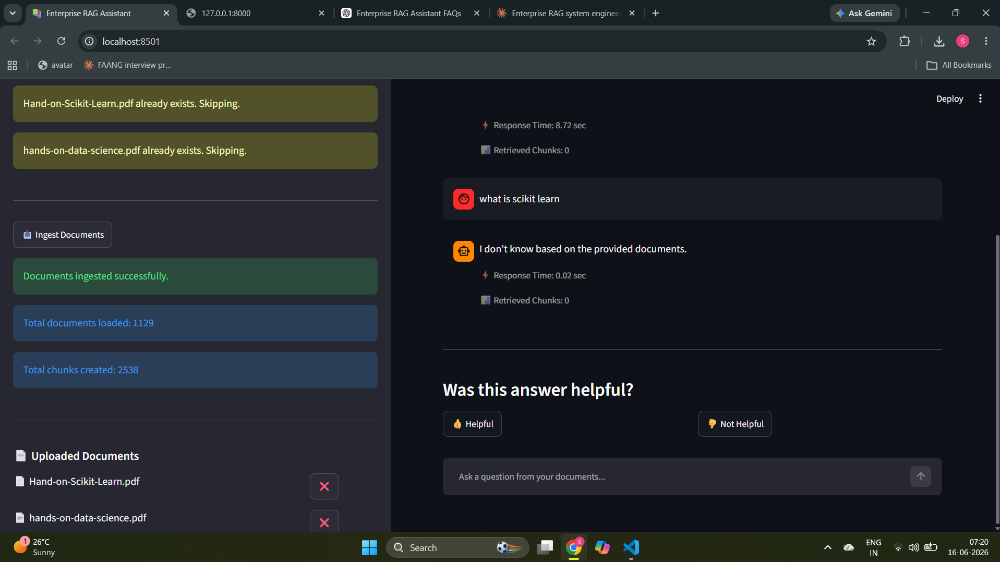

# Enterprise RAG Assistant

[](https://python.org)
[](https://fastapi.tiangolo.com)
[](https://streamlit.io)
[](https://www.trychroma.com)
[](https://hub.docker.com/repository/docker/shivamrajput130/enterprise-rag-assistant/general)
[](https://supabase.com)

A production-oriented document QA system that combines a **Hybrid RAG Pipeline** for semantic document retrieval with a **Pandas Analytics Engine** for structured data queries — connected by a **Hybrid Query Router** (schema-aware analytics detection + semantic routing) that routes each question to the right pipeline automatically.

📺 [Watch Demo](https://youtu.be/Rvdz9DKtz5o?si=GcMIR7nWABJQYCR1) | 🐳 [Docker Hub](https://hub.docker.com/repository/docker/shivamrajput130/enterprise-rag-assistant/general) | 💻 [GitHub](https://github.com/shivamrajput130/enterprise-rag-assistant)


---

## Why I Built This

Most RAG tutorials stop at "load PDF, chunk, embed, retrieve, answer." That works for a single clean PDF. It breaks when you add real document sets — CSV records, HR policies, JSON FAQs, Excel datasets — and real query types.

Two specific problems motivated this project:

**Problem 1 — Vector search fails for IDs and names.** Querying `Student_ID S127` or `Rahul Verma` returns wrong results from semantic search because IDs and names have no embedding-space meaning. The system retrieved HR policy text about "confidentiality of identification numbers" and answered confidently from the wrong document. No error signal.

**Problem 2 — RAG cannot compute.** Aggregation queries like "what is the average math score?" reached the LLM as raw text chunks. The LLM estimated. The estimates were wrong. Retrieval and computation are fundamentally different operations — mixing them into one pipeline produces poor results for both.

The solution is a two-pipeline architecture: a Hybrid RAG Pipeline for semantic questions and a Pandas Analytics Engine for analytical questions, with a Query Router that classifies each query and sends it to the right system.

---

## Project Status

| Component | Status |
|---|---|
| Multi-format ingestion — PDF, DOCX, CSV, JSON, TXT, XLS, XLSX | ✅ Complete |
| Hybrid retrieval — Vector + BM25 | ✅ Complete |
| CrossEncoder reranking | ✅ Complete |
| Query expansion | ✅ Complete |
| Query Router — Pandas vs RAG | ✅ Complete |
| Pandas Analytics Engine | ✅ Complete |
| FastAPI backend + Streamlit UI | ✅ Complete |
| Supabase PostgreSQL feedback analytics | ✅ Complete |
| Docker image published to Docker Hub | ✅ Complete |
| E2E testing — RAG + Pandas paths | ✅ Complete |
| GitHub Actions CI/CD | 🚧 In progress |
| DVC / DagsHub data versioning | 🚧 Planned |

---

## Screenshots

| | |
|---|---|
|  |  |
| RAG pipeline — semantic answer with source page numbers | Pandas Engine — aggregation answer |
|  |  |
| Hybrid search retrieving exact CSV records | Fallback for out-of-scope questions |
|  |  |
| Feedback analytics dashboard | FastAPI Swagger UI |
|  |  |
| File upload and document management | Supabase feedback storage |
|  |  |
| System architecture | Query Router routing decision |

---

## Results

### Evaluation Summary

| Metric | Value |
|---|---|
| Answer Relevancy | 0.88 |
| Context Precision | 1.00 |
| Context Recall | 1.00 |
| Avg Response Time | ~3.2 sec |
| Documents Tested | 1129 |
| Chunks Generated | 2538 |

### Scale Testing

Tested on two complete machine learning textbooks (~1800 pages combined):

| Metric | Value |
|---|---|
| Total documents loaded | **1129** |
| Total chunks generated | **2538** |
| Average warm query response time | ~3.2 seconds |
| Cold start (model loading) | ~20 seconds |
| Formats validated | PDF, DOCX, CSV, JSON, TXT, XLS, XLSX |

Duplicate detection worked correctly — re-uploading already-ingested files triggered "already exists. Skipping." Source citations with page numbers returned correctly across large multi-chapter documents.

### Retrieval Improvements (added across versions)

- Hybrid Search — Vector + BM25: fixed ID, name, and exact-token retrieval
- Query Expansion — 1 original + up to 4 generated: improved recall on short queries
- CrossEncoder Reranking: reduced source pollution, improved answer precision
- Strict Grounding Prompt: eliminated LLM answers from training data
- Source Attribution with Page Numbers: traceable citations

### Analytics Improvements (Pandas Engine)

Before the Pandas Engine, all these queries either hallucinated or returned nothing useful from RAG:

- Average / mean queries
- Count queries
- Top-N / Bottom-N rankings
- Highest / Lowest value lookup
- Range filters (score between 80 and 95)
- Multi-condition filters (class 10 AND section A)
- Negative filters (not in class 10)

---

## Architecture


```
User Question
      │
      ▼
 Query Router ← LLM classifies: tabular or semantic?
      │
      ├─────────────────────────────────────┐
      ▼                                     ▼
Pandas Analytics Engine            Hybrid RAG Pipeline
(CSV / XLS / XLSX queries)       (PDF, DOCX, JSON, TXT)
      │                                     │
      ▼                           Query Expansion
pandas operations               (1 original + up to 4)
      │                                     │
      │                           ┌─────────┴─────────┐
      │                           ▼                   ▼
      │                    Vector Search          BM25 Search
      │                 (semantic meaning)   (exact IDs, names)
      │                           │                   │
      │                           └─────────┬─────────┘
      │                                     ▼
      │                           Merge + Deduplicate
      │                                     ▼
      │                          CrossEncoder Rerank
      │                                     │
      │                         ┌───────────┴───────────┐
      │                         ▼                       ▼
      │                  Context found           No context
      │                         │                       │
      │                         ▼                       ▼
      │                Groq LLM (grounded)       Fallback response
      │
      └──────────────────────────┐
                                 ▼
                    Answer + Sources + Response time
                                 │
                                 ▼
                   Feedback → Supabase PostgreSQL
```

---

## How the Project Evolved

| Version | What changed | Why |
|---|---|---|
| V1 | PDF-only, pure vector search | Starting point |
| V2 | Multi-format loading — CSV, DOCX, JSON, TXT, XLS, XLSX | PDF-only not realistic |
| V3 | Grounding prompt + explicit fallback | LLM answered from training data |
| V4 | Query expansion | Short queries missed correct chunks |
| V5 | CrossEncoder reranking | Irrelevant chunks ranked too high |
| V6 | Hybrid retrieval — Vector + BM25 | ID and name queries failed completely |
| V7 | Pandas Analytics Engine | Aggregation queries hallucinated in RAG |
| V8 | Hybrid Query Router (schema-aware analytics detection + semantic routing) | Routing by keyword rules was unreliable |
| V9 | Supabase PostgreSQL | Local SQL Server broke in Docker |
| V10 | Docker + Docker Hub publish + Supabase cloud deployment | Reproducible, production-ready deployment |

The largest single retrieval improvement came from hybrid search — adding BM25 alongside vector search. The largest architectural improvement came from separating analytical and semantic queries into two pipelines.

---

## Query Router

The router uses **Hybrid Query Router** (schema-aware analytics detection + semantic routing) to classify each incoming query before any retrieval runs.

**Routes to Pandas Analytics Engine:**
```
What is the average math score?
Who are the top 5 students by percentage?
How many students scored above 90?
Show students in class 10 section A
Show students who did not pass
```

**Routes to Hybrid RAG Pipeline:**
```
What is the WFH policy?
Explain bias variance tradeoff
Student_ID S127
Compare probation period and leave policy
```

**Why Hybrid classification instead of keyword rules:**
Keyword rules fail on natural language variations — "Who performed best?" and "top student?" both need pandas but contain no obvious trigger keywords. An LLM understands intent more reliably than fixed rules. The trade-off is one extra LLM call per query.

---

## Pandas Analytics Engine

```python
# tabular_query.py — supported operations
# average        → df[col].mean()
# count          → conditional len()
# top N          → df.nlargest(n, col)
# bottom N       → df.nsmallest(n, col)
# filter         → df[df[col] == value]
# range filter   → df[(df[col] >= low) & (df[col] <= high)]
# multi-condition→ combined boolean indexing
# negative filter→ df[df[col] != value]
```

The engine computes directly from the DataFrame — the result is deterministic and correct. The RAG pipeline passes text to an LLM and asks it to reason over raw chunk content — it estimates, which is unreliable for numerical operations.

---

## Document Loading Strategy

| Format | Strategy | Key Metadata |
|---|---|---|
| PDF | Per-page via PyPDF | `page` number |
| DOCX | Per-paragraph via python-docx | `paragraph` number |
| CSV | Schema document + one document per row | `row` index |
| XLS / XLSX | Schema document + one document per row | `row` index |
| JSON | Per-FAQ document (FAQ structure) / full dump | `category`, `faq_id` |
| TXT | Single document | `file_name` |

CSV and Excel also remain available as DataFrames for the Pandas Analytics Engine — the same uploaded file serves both the vector store and the computation engine.

---

## Engineering Trade-offs

| Decision | Benefit | Cost |
|---|---|---|
| Hybrid Query Router (schema-aware + LLM) | Handles natural language query variations | One extra LLM call per query |
| Pandas Engine for aggregations | Deterministic correct results | Only works for CSV/Excel — not PDF tables |
| Hybrid search — Vector + BM25 | Handles both semantic and exact-token queries | BM25 rebuilds index in memory per query |
| CrossEncoder reranking | Better precision, fewer irrelevant sources | ~0.3–0.8 sec additional inference |
| Per-row CSV/Excel loading | Structured record retrieval works reliably | More documents in vector store |
| `reranker.top_k = 3` (from 5) | Fewer irrelevant source citations | May miss content on very broad queries |
| `MAX_CONTEXT_CHARS = 8000` | Prevents token limit errors | May truncate long contexts |
| ChromaDB over FAISS | Automatic disk persistence | Slower than FAISS for pure in-memory use |
| Supabase over SQL Server | Cloud-native, works in Docker | Requires Supabase account |
| BGE over MiniLM | Better multi-concept retrieval | Larger model, slower to load |

---

## Features

**Ingestion**
- Multi-format loading — PDF, DOCX, CSV, JSON, TXT, XLS, XLSX
- `RecursiveCharacterTextSplitter` with configurable chunk size and overlap
- Text cleaning before embedding — null bytes, BOM characters, zero-width spaces
- MD5-based deterministic chunk IDs — re-ingesting the same file skips duplicates
- BGE embeddings singleton — loaded once at startup, not per query
- ChromaDB persistent storage — survives process restarts without re-ingestion

**Query Routing and Retrieval**
- Hybrid Query Router (schema-aware analytics detection + semantic routing) — classifies each query as tabular or semantic
- Pandas Analytics Engine — average, count, top-N, filter, range, multi-condition, negative filter
- Query expansion — 1 original + up to 4 generated alternatives with output cleaning and fallback
- Hybrid retrieval — dense vector search + BM25 keyword search
- Merge and deduplicate by `source + content` key before reranking
- CrossEncoder reranking
- `MAX_CONTEXT_CHARS = 8000` context length guard

**Generation**
- Strict grounding prompt — LLM answers only from retrieved context
- Entity-aware prompt rules — ID and name queries return all available fields
- Explicit fallback — `"I don't know based on the provided documents."` — tested in E2E suite
- Source citations with page numbers

**API and UI**
- FastAPI backend with Pydantic request validation
- Response includes `answer`, `retrieved_chunks`, `response_time`, `sources`
- Streamlit chat UI
- File upload, per-file delete, full vector store reset from sidebar
- Export chat history as `.txt`
- System is stateless — no conversational memory across sessions

**Feedback and Analytics**
- Thumbs up/down feedback stored in Supabase PostgreSQL
- Analytics dashboard — positive %, negative %, failed query table
- E2E test script — keyword checks for both RAG and Pandas Engine paths

**Deployment**
- Docker image published to [Docker Hub](https://hub.docker.com/repository/docker/shivamrajput130/enterprise-rag-assistant/general) — Docker Image Size: ~4.3 GB
- Credentials via `.env` — no secrets in image
- `start.sh` for coordinated FastAPI + Streamlit startup

---

## Testing

### Unit Testing
- Query Router — tabular vs semantic classification validation
- Pandas Analytics Engine — average, count, top-N, filter, range, negative filter
- Document Loader — per-format loading and metadata validation
- Retrieval pipeline — vector search, BM25, merge, dedup, rerank

### End-to-End Testing
- FastAPI `/ask` endpoint — both pipeline paths
- Streamlit workflow — upload, ingest, query, feedback
- Feedback storage — Supabase write and read
- Docker container — build, run, env variable loading, FastAPI + Streamlit startup

### Dataset Interaction Testing

**Student Dataset (CSV/Excel):**
- Average score calculations
- Top-N and Bottom-N ranking queries
- Multi-condition filters (class + section)
- Negative filters (exclude class)
- Range filters (scores between X and Y)

**HR Policy Dataset (DOCX):**
- Policy retrieval — WFH, probation, leave
- Comparison questions across policies
- Benefits and entitlement queries

**Company Notes Dataset (TXT):**
- Process and workflow retrieval
- Core values and onboarding questions

**Machine Learning Theory Dataset (PDF):**
- Overfitting and underfitting
- Bias-variance tradeoff
- PCA and dimensionality reduction
- Ensemble learning
- Precision, recall, F1-score

**Large Document Validation:**
Tested on *Hands-On Machine Learning with Scikit-Learn* and *Hands-On Data Science* — two complete textbooks (~1800 pages combined). The retrieval pipeline generated grounded answers with source citations and correct page numbers. Fallback worked correctly for out-of-scope questions. Duplicate detection skipped already-ingested files correctly.

**RAGAS Evaluation (experimental):**
Integrated for automated evaluation. Best stable run — Answer Relevancy: 0.88, Context Precision: 1.00, Context Recall: 1.00. Faithfulness evaluation was limited by evaluator rate constraints — the application and evaluator shared the same Groq rate limit. `ragas==0.2.10` is pinned — newer versions have breaking LangChain compatibility issues.

---

## Project Structure

```
enterprise-rag-assistant/
├── api/
│   ├── main.py              # FastAPI app, /ask endpoint
│   ├── routes.py
│   └── schema.py            # Pydantic request/response models
├── app/
│   └── streamlit_app.py     # Chat UI, upload, feedback, analytics
├── assets/                  # Screenshots
│   ├── architecture.png
│   ├── chat_interface.png
│   ├── analytics_queries.png
│   ├── fallback_behavior.png
│   ├── fastapi_api.png
│   ├── feedback_dashboard.png
│   ├── file_upload.png
│   ├── hybrid_search.png
│   ├── query_router.png
│   ├── supabase_feedback.png
│   ├── system_workflow.png
│   └── tabular_engine.png
├── src/
│   ├── config_loader.py
│   ├── document_loader.py   # All format loaders
│   ├── embeddings.py        # BGE singleton
│   ├── exception.py         # RagException with file + line number
│   ├── feedback_analytics.py
│   ├── feedback_db.py       # Supabase PostgreSQL
│   ├── llm.py               # Groq LLM wrapper
│   ├── logger.py            # Timestamped log files
│   ├── pipeline.py          # Ingestion orchestration
│   ├── query_expansion.py
│   ├── query_router.py      # Routes to Pandas or RAG
│   ├── rag_chain.py
│   ├── reranker.py          # CrossEncoder singleton
│   ├── retriever.py         # Hybrid retrieval
│   ├── tabular_query.py     # Pandas Analytics Engine
│   ├── text_splitter.py
│   └── vector_store.py      # ChromaDB, MD5 dedup, text cleaning
├── evaluation/
│   ├── run_evals.py
│   ├── evals_results.csv
│   └── test_questions.csv
├── tests/
│   ├── test_e2e.py
│   └── e2e_test_cases.csv
├── docs/
│   ├── architecture.md
│   ├── evaluation.md
│   └── docker.md
├── data/
│   ├── documents/
│   └── vectorstore/
├── config.yaml
├── CASE_STUDY.md
├── Dockerfile
├── start.sh
├── requirements.txt
├── .env.example
└── .gitignore
```

---

## Prerequisites

| Variable | Required | Purpose |
|---|---|---|
| `GROQ_API_KEY` | Yes | All LLM calls — query routing, expansion, answer generation |
| `SUPABASE_URL` | For feedback | Supabase project URL |
| `SUPABASE_KEY` | For feedback | Supabase anon key |

Without `GROQ_API_KEY` the system cannot run. Without Supabase credentials, feedback buttons will error — the RAG pipeline and Pandas Engine work without it.

---

## Setup — Docker (recommended)

```bash
# Pull from Docker Hub
docker pull shivamrajput130/enterprise-rag-assistant:latest

# Create .env
cp .env.example .env
# Fill in GROQ_API_KEY and Supabase credentials

# Run
docker run --env-file .env \
  -p 8000:8000 \
  -p 8501:8501 \
  -v $(pwd)/data:/app/data \
  shivamrajput130/enterprise-rag-assistant:latest
```

- Streamlit UI: `http://localhost:8501`
- FastAPI backend: `http://localhost:8000`
- API docs: `http://localhost:8000/docs`

Full Docker documentation: [docs/docker.md](./docs/docker.md)

---

## Setup — Local

```bash
uv venv
source .venv/bin/activate    # Windows: .venv\Scripts\activate

uv pip install -r requirements.txt

cp .env.example .env
# Add GROQ_API_KEY, SUPABASE_URL, SUPABASE_KEY

# Terminal 1 — backend
uv run uvicorn api.main:app --reload

# Terminal 2 — UI
uv run streamlit run app/streamlit_app.py
```

---

## Configuration

```yaml
chunking:
  chunk_size: 1000
  chunk_overlap: 200

embedding:
  model_name: "BAAI/bge-base-en-v1.5"

llm:
  provider: "groq"
  model_name: "llama-3.1-8b-instant"
  temperature: 0.3
  max_tokens: 1024

retriever:
  top_k: 8
  per_query_k: 4
  hybrid_search:
    enabled: true
    bm25_top_k: 6

reranker:
  model_name: "cross-encoder/ms-marco-MiniLM-L-6-v2"
  top_k: 3

debug:
  retrieval: false
  reranker: false
```

All values configurable in `config.yaml`. No hardcoded parameters in the pipeline.

---

## Test Queries

**RAG Pipeline — semantic questions:**
```
When is salary credited?                   → employee_faq.json
Student_ID S127                            → student_marks.csv (via BM25)
Explain bias variance tradeoff             → ml_theory.pdf
Compare probation period and WFH policy    → two documents combined
Who won IPL 2026?                          → fallback
```

**Pandas Analytics Engine — structured questions:**
```
What is the average math score?            → mean via pandas
Who are the top 3 students?                → nlargest on percentage
How many students scored above 90?         → conditional count
Show students in class 10 section A        → multi-condition filter
```

---

## Known Limitations

- BM25 rebuilds index from full corpus in memory per query — works at 2538 chunks, degrades at much larger scale
- Pandas Engine handles CSV and Excel only — tables embedded in PDF or DOCX are not extracted
- Query Router accuracy depends on how clearly the query signals its type — ambiguous queries may occasionally misroute
- RAGAS faithfulness metric not reliably measurable with Groq as evaluator (rate limit conflicts)
- `MAX_CONTEXT_CHARS = 8000` may truncate very long contexts mid-sentence
- No chat history memory across sessions
- Streamlit streaming is simulated — not real server-sent events
- No authentication — API is open

---

## Key Lessons

- Retrieval quality had more impact on answer quality than changing the LLM
- Aggregation and semantic queries are fundamentally different problems — one pipeline cannot serve both well
- Hybrid search was the single largest retrieval improvement
- Confident wrong answers with no error signal (vector search on IDs) are harder to catch than empty answers
- Evaluation tooling can be harder to stabilize than the application itself
- Design for Docker from the start — retrofitting it at the end is more work

---

## What's Next

- GitHub Actions CI/CD pipeline — currently in progress
- DVC / DagsHub data versioning
- Persistent BM25 index for larger corpora
- Pandas Engine support for PDF-embedded tables
- User authentication
- Chat history memory across sessions
- Real streaming — server-sent events instead of simulated word delay

---

## Why Not Traditional RAG?

| Query | Traditional RAG | This System |
|---|---|---|
| `Student_ID S127` | Weak — no semantic meaning for IDs | BM25 exact token match |
| Average marks | Hallucination — LLM estimates from text | Pandas deterministic computation |
| Top 5 students | Weak — ranking requires computation | Pandas `nlargest()` |
| WFH policy | Good | Hybrid RAG (Vector + BM25) |

Traditional RAG passes text chunks to an LLM. It cannot compute, rank, or aggregate — it can only retrieve and summarize. This system adds a Hybrid Query Router and Pandas Analytics Engine to handle the cases where RAG fails by design.

---

## Resume Impact

Key engineering challenges solved:

- **Multi-format ingestion** — PDF, DOCX, CSV, JSON, TXT, XLS, XLSX with format-specific loading strategies
- **Hybrid Retrieval** — Vector + BM25 to handle both semantic and exact-token queries
- **Query Routing** — Hybrid router classifying tabular vs semantic queries at runtime
- **Structured Analytics** — Deterministic pandas operations for aggregation queries that RAG cannot handle
- **Feedback Analytics** — Supabase PostgreSQL feedback loop surfacing failure patterns
- **Dockerization** — Fully containerized multi-service deployment published to Docker Hub
- **Production Configuration Management** — All tunable parameters in `config.yaml`, zero hardcoding

---

## Security

- API keys stored in `.env`
- No secrets committed to Git
- Docker image contains no credentials
- Supabase access controlled through environment variables
- `.env` excluded through `.gitignore`

---

## Development Environment

- Windows 11
- Python 3.11
- Intel i5-12450H
- 16 GB RAM
- NVIDIA GTX 1650 (4 GB)

---

## Full Documentation

| Document | Contents |
|---|---|
| [CASE_STUDY.md](./CASE_STUDY.md) | Full development journey — every bug, fix, and decision |
| [docs/evaluation.md](./docs/evaluation.md) | RAG + Pandas analytics + Docker evaluation results |
| [docs/architecture.md](./docs/architecture.md) | Architecture deep-dive, component map, retrieval math |
| [docs/docker.md](./docs/docker.md) | Docker Hub, build, run, environment variables, troubleshooting |
