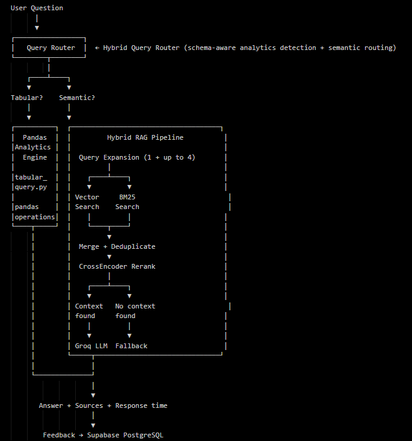
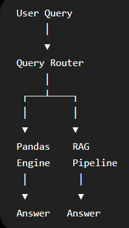

# RAG Assistant — System Architecture

📺 [Watch Demo](https://youtu.be/Rvdz9DKtz5o?si=GcMIR7nWABJQYCR1) | 🐳 [Docker Hub](https://hub.docker.com/repository/docker/shivamrajput130/enterprise-rag-assistant/general) | 💻 [GitHub](https://github.com/shivamrajput-ds/enterprise-rag-assistant) | Screenshots: `assets/` folder




---

## Design Principles

1. **Two pipelines, not one** — semantic retrieval and tabular computation are separate problems. Mixing them produces poor results for both.
2. **Retrieval before generation** — answer quality depends on retrieval quality, not just the LLM.
3. **Config over hardcoding** — all tunable parameters live in `config.yaml`.
4. **Fail safely** — missing context, failed expansion, empty vector store, and missing Supabase credentials all have explicit fallbacks.
5. **Local-first development** — ChromaDB persists locally while Supabase provides cloud-native feedback storage.

The project's most important architectural evolution was adding the Query Router and Pandas Analytics Engine. Before that, aggregation queries ("what is the average score?") either hallucinated or returned irrelevant text chunks. The RAG pipeline is designed for semantic retrieval — not computation.

---

## Test Corpus

| File | Format | Content |
|---|---|---|
| `ml_theory.pdf` | PDF | Machine learning theory notes |
| `hr_policy.docx` | DOCX | HR policies — WFH, probation, leave |
| `student_marks.csv` | CSV | Student records with IDs, names, grades |
| `employee_faq.json` | JSON | Employee FAQ — salary, tools, onboarding |
| `company_notes.txt` | TXT | Internal process notes, core values |

**Controlled test corpus:** ~5 files used for functional testing.

**Real-world scale test:** Two full ML/data science textbooks (~1800 pages combined). Large-scale validation performed on two ML textbooks generating thousands of chunks.
- Total documents loaded: **1129**
- Total chunks created: **2538**
- Retrieval, source citations with page numbers, and fallback all worked correctly at this scale.

Results on significantly larger corpora (10,000+ chunks) have not been tested. BM25 index rebuild per query is the expected first bottleneck.

---

## Full System Architecture

```
User Question
      │
      ▼
┌─────────────────┐
│   Query Router  │  ← Hybrid Query Router (schema-aware analytics detection + semantic routing)
└────────┬────────┘
         │
    ┌────┴────┐
    ▼         ▼
Tabular?    Semantic?
    │         │
    ▼         ▼
┌──────────┐  ┌─────────────────────────────────────┐
│  Pandas  │  │         Hybrid RAG Pipeline          │
│Analytics │  │                                      │
│  Engine  │  │  Query Expansion (1 + up to 4)       │
│          │  │         │                            │
│tabular_  │  │    ┌────┴────┐                       │
│query.py  │  │    ▼         ▼                       │
│          │  │ Vector     BM25                       │
│pandas    │  │ Search    Search                      │
│operations│  │    │         │                       │
└────┬─────┘  │    └────┬────┘                       │
     │        │         ▼                            │
     │        │  Merge + Deduplicate                 │
     │        │         ▼                            │
     │        │  CrossEncoder Rerank                 │
     │        │         │                            │
     │        │    ┌────┴────┐                       │
     │        │    ▼         ▼                       │
     │        │ Context   No context                  │
     │        │ found     found                      │
     │        │    │         │                       │
     │        │    ▼         ▼                       │
     │        │ Groq LLM  Fallback                   │
     │        └─────┬───────────────────────────────┘
     │              │
     └──────────────┘
                    │
                    ▼
       Answer + Sources + Response time
                    │
                    ▼
        Feedback → Supabase PostgreSQL
```

---

## Ingestion Pipeline

```
Uploaded Files (PDF, DOCX, CSV, JSON, TXT, Excel)
        │
        ▼
document_loader.py — format-specific loading strategy
        │
        ▼
LangChain Document objects with metadata
        │
        ▼
text_splitter.py
RecursiveCharacterTextSplitter
separators: ["\n\n", "\n", ".", " ", ""]
chunk_size + chunk_overlap from config.yaml
Empty chunks filtered after splitting
        │
        ▼
vector_store.py
clean_for_embedding() — remove \x00, \ufeff, \u200b
create_chunk_id() — MD5(source + content)
BAAI/bge-base-en-v1.5 embeddings (singleton)
ChromaDB persistent disk storage
```

CSV and Excel files also remain available as DataFrames for the Pandas Analytics Engine — the same file serves both the vector store and the computation engine.

---

## Document Loading Strategy

| Format | Strategy | Key Metadata |
|---|---|---|
| PDF | Per-page via PyPDF | `file_name`, `page` |
| DOCX | Per-paragraph via python-docx | `file_name`, `paragraph` |
| CSV | Schema Document + per-row Documents | `file_name`, `row` index |
| Excel | Schema Document + per-row Documents | `file_name`, `row` index |
| JSON | Per-FAQ Documents (FAQ structure) / full dump | `category`, `faq_id` |
| TXT | Single Document | `file_name` |

Without per-row loading for CSV/Excel, chunking splits records mid-row. A query for `Student_ID S127` retrieves a chunk containing the tail of one record and the start of the next — neither is complete or useful.

---

## Query Router

```python
# query_router.py
# Hybrid Query Router (schema-aware analytics detection + semantic routing)
# Classifies query into one of two categories:
# "tabular"  → Pandas Analytics Engine
# "semantic" → Hybrid RAG Pipeline
```

**Why Hybrid routing instead of keyword rules:**
Keyword rules ("if query contains 'average' → pandas") fail on natural language variations. "Who performed best?" and "top student?" both need pandas but contain no obvious keywords. The Hybrid Router (schema-aware detection + LLM intent classification) handles these reliably where fixed rules cannot.

**Known routing limitation:**
Ambiguous queries may be misrouted. "Tell me about student S127's performance" could reasonably go to either pipeline. The current router sends it to RAG (exact record lookup). This is acceptable — BM25 retrieves the correct row. A more sophisticated router would handle borderline cases explicitly.

**Trade-off:** Every query adds one LLM classification call before retrieval. This adds latency but prevents a more expensive failure — sending an aggregation query to the RAG pipeline and getting a hallucinated answer.

---

## Pandas Analytics Engine

```python
# tabular_query.py
# Supported operations on CSV/Excel files:
# average / mean         → df[col].mean()
# count                  → len(df) or df[col].count()
# top N                  → df.nlargest(n, col)
# bottom N               → df.nsmallest(n, col)
# filter by value        → df[df[col] == value]
# filter by range        → df[(df[col] >= low) & (df[col] <= high)]
# multi-condition        → combined boolean indexing
# negative filter        → df[df[col] != value]
```

**Why this matters:**
The RAG pipeline passes text chunks to an LLM and asks it to answer. An LLM reading raw text cannot reliably compute averages, rankings, or counts — it guesses. The Pandas Engine computes them directly from the DataFrame. The result is deterministic and correct.

**Scope:**
The Pandas Engine only handles CSV and Excel. Tables embedded inside PDF or DOCX files are not extracted — those still go through the RAG pipeline as text.

---

## Chunking

```python
splitter = RecursiveCharacterTextSplitter(
    chunk_size=config["chunking"]["chunk_size"],       # 1000
    chunk_overlap=config["chunking"]["chunk_overlap"], # 200
    separators=["\n\n", "\n", ".", " ", ""]
)
```

Separator priority: paragraphs → lines → sentences → words → characters (fallback only).

Chunk overlap of 200 characters preserves continuity across chunk boundaries. Without overlap, a sentence split at a boundary loses context in both resulting chunks.

**Trade-off:** Larger chunks improve context completeness but consume more tokens. Smaller chunks improve retrieval precision but may miss surrounding context. `chunk_size=1000` was chosen empirically on the test corpus.

---

## Embeddings

**Model:** `BAAI/bge-base-en-v1.5` (~768 dimensions)

Started with `all-MiniLM-L6-v2` (384 dimensions). Multi-concept queries like "compare probation period and WFH policy" retrieved poor-quality chunks. Switching to BGE improved retrieval quality noticeably. The extra embedding time was acceptable.

**Singleton pattern:**
```python
_embedding_model = None

def get_embedding_model():
    global _embedding_model
    if _embedding_model is not None:
        return _embedding_model
    _embedding_model = HuggingFaceEmbeddings(model_name=config["embedding"]["model_name"])
    return _embedding_model
```

Without this, the model reloads on every query — adding 3–4 seconds of latency per request. The singleton loads once per process. Same pattern applied to the CrossEncoder reranker.

**Known limitation:** Changing the embedding model requires deleting the ChromaDB collection and re-ingesting all documents. Stored vectors are incompatible across different models.

---

## Vector Store — ChromaDB

ChromaDB provides automatic persistence. FAISS also supports persistence via `write_index`/`read_index` but requires explicit lifecycle management code on every restart. ChromaDB was chosen for simpler local development, not for performance reasons.

**MD5-based chunk deduplication:**
```python
def create_chunk_id(chunk):
    source = chunk.metadata.get("source", "")
    content = chunk.page_content or ""
    return hashlib.md5((source + content).encode("utf-8")).hexdigest()
```

Same source + same content → same ID. ChromaDB uses these as primary keys. Re-uploading an unchanged file produces no duplicate chunks. Re-uploading a modified file only adds new chunks for changed content.

**Cold start:** Empty ChromaDB returns an empty list from retrieval immediately. The RAG chain returns the fallback response. No crash, no misleading error.

---

## Query Expansion

```python
# 1 original + up to 4 LLM-generated = max 5 total (deduplicated)
# clean_expanded_query() strips bullets, numbers, quotes from LLM output
# Fallback: returns [original_query] if expansion fails
```

Short queries embed poorly against longer paragraphs. "WFH policy?" as a 768-dimension vector sits in a different region of embedding space than the paragraph that answers it. Multiple paraphrased versions increase the likelihood of a close vector match.

**Example:**
```
Input:  When is salary credited?

Output: When is salary credited?
        When does payroll get deposited?
        Salary payment schedule
        Employee salary credit date
        When are salaries paid?
```

**Known limitation:** Expansion adds noise for exact-token queries like `S127`. Semantic paraphrases of an ID have no relationship to the chunk containing that ID. BM25 handles this case instead. The reranker partially compensates by scoring all candidates against the original query.

---

## Hybrid Retrieval

```python
# Vector search
for expanded_query in expanded_queries:
    results = vector_store.similarity_search_with_score(query=expanded_query, k=per_query_k)
    all_vector_results.extend(results)
vector_docs = [doc for doc, score in sorted_results[:retriever_top_k]]

# BM25 search
def bm25_search(query, documents, top_k):
    bm25 = BM25Okapi([tokenize(doc.page_content) for doc in documents])
    scores = bm25.get_scores(tokenize(query))
    scored = sorted(zip(documents, scores), key=lambda x: x[1], reverse=True)
    return [doc for doc, score in scored[:top_k] if score > 0]
```

| Query type | Vector search | BM25 |
|---|---|---|
| "salary credited" | Works — matches "payroll deposited" | Weaker |
| `S127` | Fails — no semantic meaning | Works — exact token |
| `Rahul Verma` | Unreliable | Works — exact match |
| "explain overfitting" | Works | Weaker |

**BM25 memory note:** BM25 loads all chunks from ChromaDB into memory and rebuilds its index per query. At 2538 chunks this is fast. For very large corpora a persistent keyword index would be needed.

**Future Improvement:** Persistent BM25 index (Whoosh / Elasticsearch / OpenSearch)

---

## Retrieval Parameters

```
1 original + up to 4 generated   →  up to 5 search queries
5 queries × 4 per_query_k        →  up to 20 raw vector results
Keep top 8 (retriever_top_k)     →  8 vector candidates
Add up to 6 BM25 results         →  up to 14 candidates
Deduplicate by source + content   →  N unique candidates
CrossEncoder rerank               →  keep top 3 (reranker_top_k)
Send to Groq LLM                  →  context window
```

All six values are in `config.yaml`. No hardcoded retrieval parameters.

---

## CrossEncoder Reranking

```python
pairs = [[query, doc.page_content] for doc in docs]
scores = model.predict(pairs)
scored_docs = sorted(zip(docs, scores), key=lambda x: x[1], reverse=True)
final_docs = [doc for doc, _ in scored_docs[:top_k]]
```

CrossEncoder reads query and chunk together as a pair with full cross-attention. This is more accurate than cosine similarity, which compares independently compressed vectors.

Runs on ~14 candidates, not the full corpus. Observed additional latency: approximately 0.3–0.8 seconds on the test hardware (i5-12450H, 16 GB RAM, GTX 1650). Not formally benchmarked.

---

## Answer Generation

```python
context = "\n\n".join([
    f"Source: {doc.metadata.get('file_name', 'unknown')}\n{doc.page_content}"
    for doc in docs
])
MAX_CONTEXT_CHARS = 8000
context = context[:MAX_CONTEXT_CHARS]
```

`MAX_CONTEXT_CHARS = 8000` added after Groq token limit errors on long multi-document queries. Known risk: may truncate a relevant passage near position 8000 characters.

Prompt enforces:
- Use only retrieved context
- Never use training data knowledge
- For entity/ID queries: return all available fields
- Fallback: `"I don't know based on the provided documents."` — exact string, tested in E2E suite

---

## Feedback System — Supabase PostgreSQL

```python
# feedback_db.py
# Stores query, answer, and feedback (positive/negative) to Supabase
# via psycopg2 connection to PostgreSQL
```

Supabase replaced the original local MS SQL Server setup. The SQL Server required local installation and a machine-specific connection string — not portable across environments or Docker containers. Supabase is cloud-native and works from any machine with the correct credentials.

The negative feedback table surfaced which queries the system answered badly — typically aggregation queries (before the Pandas Engine), ambiguous short queries, and multi-hop cross-document questions. This directly informed what to fix next.

If Supabase credentials are not set in `.env`, feedback buttons show a configuration error. The RAG pipeline and Pandas Engine run without Supabase.

---

## API Layer

| Endpoint | Method | Purpose |
|---|---|---|
| `/` | GET | Root health message |
| `/health` | GET | Health check |
| `/ask` | POST | Main query endpoint — routes to Pandas or RAG |

Response schema:
```json
{
  "answer": "...",
  "retrieved_chunks": 3,
  "response_time": 2.41,
  "sources": ["employee_faq.json"]
}
```

Response time is measured from request receipt to answer return at the FastAPI layer.

---

## Notable Failures During Development

| Failure | Root cause | Fix |
|---|---|---|
| Aggregation queries hallucinated | RAG pipeline cannot compute — only retrieve | Query Router + Pandas Analytics Engine |
| CSV stored as text blob | All formats treated the same initially | Per-row Document creation |
| ID/name queries failed | Semantic search cannot represent arbitrary tokens | BM25 + hybrid retrieval |
| LLM answered from training data | No grounding constraint | Strict grounding prompt + fallback |
| Source pollution — wrong files cited | All 20 retrieved chunks sent to LLM | CrossEncoder reranking, `reranker_top_k=3` |
| Token limit errors | Full merged context sent to Groq | `MAX_CONTEXT_CHARS = 8000` |
| RAGAS dependency conflicts | Breaking API changes in newer LangChain | Pinned `ragas==0.2.10` |
| Negative filter queries returned wrong rows | Pandas boolean logic edge case | Fixed in `tabular_query.py` |
| Query Router misclassified edge cases | Ambiguous query phrasing | Prompt refinement on router LLM call |
| Docker environment variable errors | `.env` not passed to container correctly | `--env-file .env` in run command |

---

## Component Map

| File | Responsibility |
|---|---|
| `document_loader.py` | Format-specific loaders: per-row, per-page, per-FAQ |
| `text_splitter.py` | RecursiveCharacterTextSplitter + empty chunk filter |
| `embeddings.py` | BGE model singleton |
| `vector_store.py` | ChromaDB operations, MD5 chunk IDs, text cleaning |
| `query_router.py` | Hybrid Query Router — schema-aware analytics detection + semantic routing |
| `tabular_query.py` | Pandas Analytics Engine — aggregations, filters, rankings |
| `query_expansion.py` | LLM expansion, output cleaning, fallback |
| `retriever.py` | Hybrid retrieval, BM25, merge, dedup |
| `reranker.py` | CrossEncoder singleton, debug logging |
| `rag_chain.py` | Context assembly, token guard, prompt, LLM call |
| `llm.py` | Groq LLM wrapper |
| `pipeline.py` | Ingestion orchestration |
| `api/main.py` | FastAPI app and routing |
| `api/schema.py` | Pydantic request/response models |
| `app/streamlit_app.py` | Chat UI, upload, feedback, analytics |
| `feedback_db.py` | Supabase PostgreSQL insert via psycopg2 |
| `feedback_analytics.py` | Feedback summary and failed query table |
| `config_loader.py` | `config.yaml` loader |
| `logger.py` | Timestamped log files |
| `exception.py` | `RagException` with file name and line number |

---

## Development Environment

- Windows 11
- Intel i5-12450H
- 16 GB RAM
- NVIDIA GTX 1650 (4 GB)
- Python 3.11

---

## Security Notes

- API keys stored in `.env`
- Supabase credentials never committed to Git
- Docker images require runtime environment variables
- No secrets stored in source code
- `.env` excluded through `.gitignore`

---

## Docker Deployment

Container exposes:

- FastAPI → Port 8000
- Streamlit → Port 8501

Docker Image Size: ~4.3 GB

Environment variables supplied via:
```
docker run --env-file .env ...
```

---

## Architecture Evolution

| Version | Change |
|---|---|
| V1 | Basic RAG |
| V2 | Multi-format Loader |
| V3 | Query Expansion |
| V4 | CrossEncoder Reranking |
| V5 | Hybrid Search |
| V6 | Feedback System |
| V7 | Pandas Analytics Engine |
| V8 | Query Router |
| V9 | Dockerized Deployment |
| V10 | Docker Hub + Supabase Cloud Deployment |

---

## Why Not Traditional RAG?

| Query | Traditional RAG | This System |
|---|---|---|
| `Student_ID S127` | Weak — no semantic meaning for arbitrary IDs | BM25 exact token match |
| Average marks | Hallucination — LLM guesses from text | Pandas deterministic computation |
| Top 5 students | Weak — ranking requires computation | Pandas `nlargest()` |
| WFH policy | Good | Hybrid RAG (vector + BM25) |

Traditional RAG passes text chunks to an LLM. It cannot compute, rank, or aggregate — it can only retrieve and summarize. This system adds a Query Router and Pandas Analytics Engine to handle the cases where RAG fails by design.

---

## Tech Stack

| Technology | Why |
|---|---|
| Python 3.11 | Primary language |
| `uv` | Faster dependency management |
| PyPDF, python-docx, pandas | Format-specific document loading |
| LangChain | Document objects, text splitters |
| `BAAI/bge-base-en-v1.5` | Better semantic retrieval than smaller models |
| ChromaDB | Automatic disk persistence |
| `rank_bm25` BM25Okapi | Exact keyword retrieval for IDs and names |
| `cross-encoder/ms-marco-MiniLM-L-6-v2` | Accurate relevance scoring |
| Groq API (llama-3.1-8b-instant) | Low latency, developer free tier |
| FastAPI + Pydantic | Typed API with request validation |
| Streamlit | Rapid UI without frontend boilerplate |
| Supabase PostgreSQL | Cloud-native feedback storage |
| Docker | Reproducible containerized deployment |
| `config.yaml` | Single source of truth for tunable parameters |